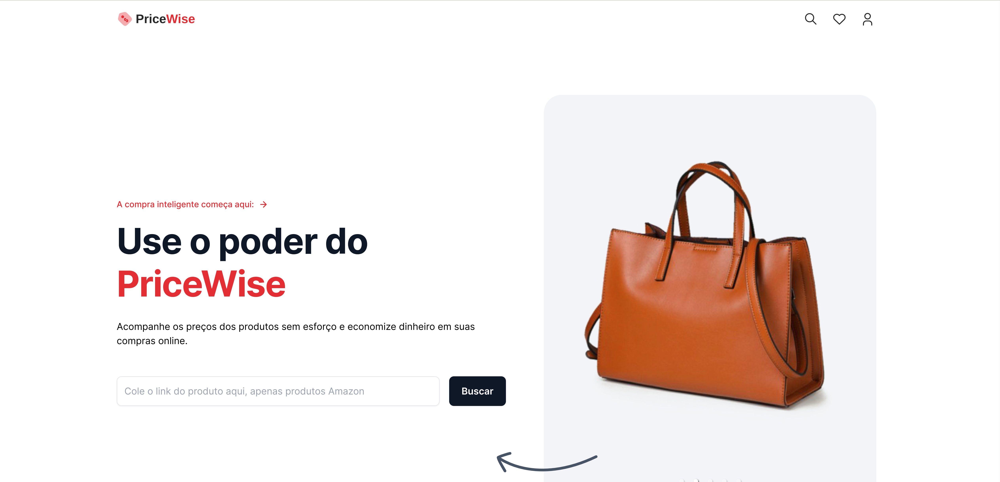

<p align="center">
  
</p>

<p align="center">
  
</p>

<br>

## 🧪 Tecnologias

Esse projeto foi desenvolvido com as seguintes tecnologias:

- [NextJS](https://nextjs.org/)
- [Tailwind CSS](https://tailwindcss.com/)
- [TypeScript](https://www.typescriptlang.org/)
- [Mongoose](https://mongoosejs.com/)
- [Nodemailer](https://nodemailer.com/)
- [Cheerio](https://cheerio.js.org/)
- [Bright Data](https://brightdata.com.br/)

## 💻 Projeto

Bem-vindo ao projeto Pricewise, uma solução abrangente para rastrear preços de produtos na Amazon. Este projeto foi projetado para extrair detalhes do produto da Amazon, armazenar os dados em um banco de dados MongoDB e enviar notificações por e-mail aos usuários quando houver alterações nos detalhes do produto. O projeto inclui um aplicativo web com uma interface amigável que permite aos usuários pesquisar produtos, visualizar detalhes do produto e assinar atualizações de produtos.

## 🚀 Como executar

Clone o projeto e acesse a pasta do mesmo.

```bash
$ git clone https://github.com/CesarNeo/prisewise.git
$ cd pricewise
```

Para iniciá-lo, siga os passos abaixo:

```bash
# Instalar as dependências
$ npm install

# Iniciar o projeto
$ npm run dev
```

O app estará disponível no seu browser pelo endereço http://localhost:3000.
